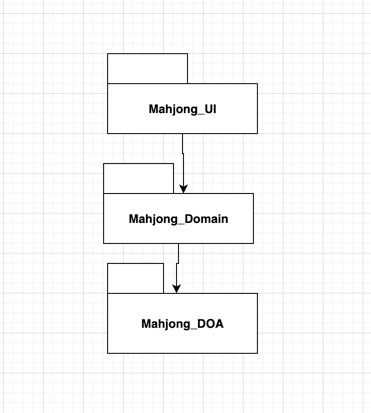
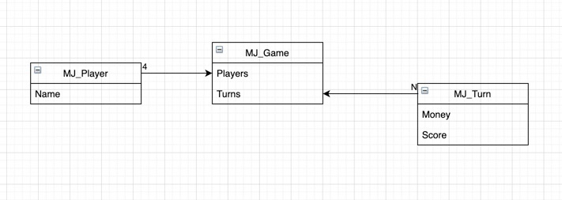
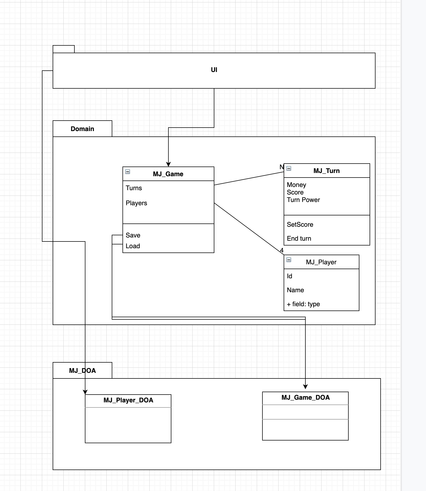
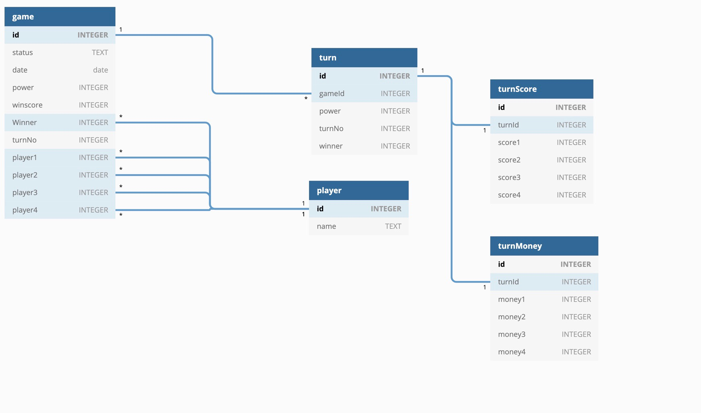
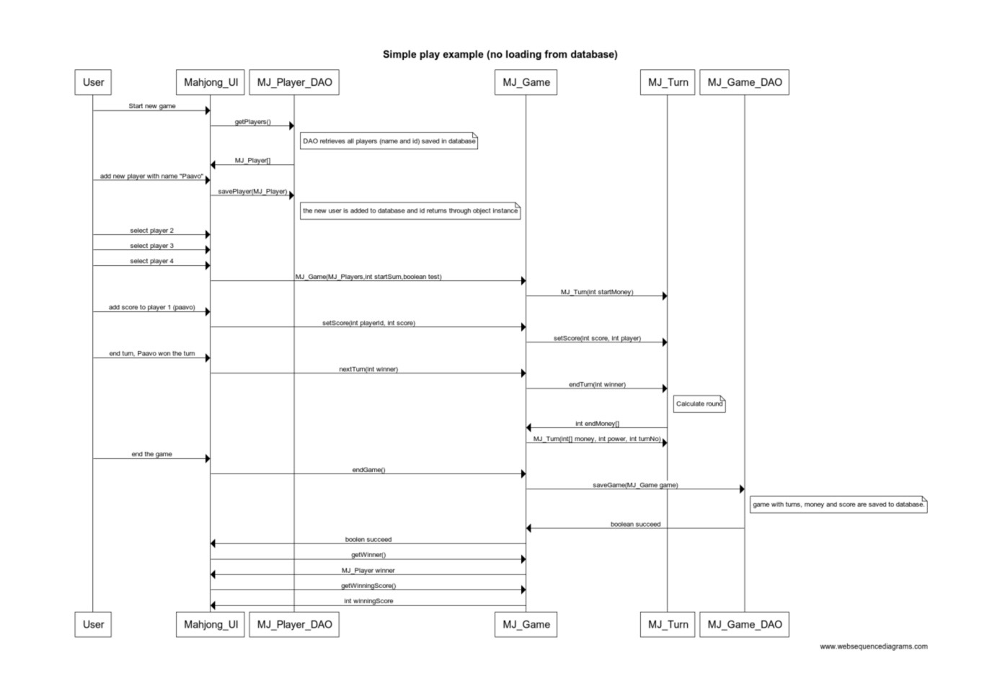

# Mahjong Manager architecture

## Structure of application

Mahjong manager contains 3 packages with following structure

However the princible of the packages is slightly violated as UI can directly contact DOA package to retrieve loaded data from database.
Package [Mahjong_UI](https://github.com/tuomoM/ot-harjoitustyo/tree/master/MahjongManager/src/main/java/Mahjong_UI) contains text user interface built for the application.

## User interface

User interface is built as a simple text userinterface. It serves the purpose and is easy to use.

## Application logic

The logical datamodel of the game is based on classes [MJ_Game.java](https://github.com/tuomoM/ot-harjoitustyo/blob/master/MahjongManager/src/main/java/Mahjong_domain/MJ_Game.java), [MJ_Player.java](https://github.com/tuomoM/ot-harjoitustyo/blob/master/MahjongManager/src/main/java/Mahjong_domain/MJ_Player.java) and [MJ_Turn.java](https://github.com/tuomoM/ot-harjoitustyo/blob/master/MahjongManager/src/main/java/Mahjong_domain/MJ_Turn.java)
The relation is as in the picture:

Each game has 4 players and 1 or more rounds.
Class MJ_Game has all the gameplay relevant methods that can be called from UI.
Such as:
* setScore(int player)
* nextTurn(int winner)
* saveGame()

The relationship between the packages and classes are visible in the below 

## data storing and saving

The players and the game can be saved to database. In fact they are always saved.
Classes were originally planned to follow proper Data Access Object model, but due to timeline and sudden issues with Mac OS, the finalization of this was not done.
During the actual gameplay the information is stored in file:
>MjDb.db

During a test cycle the test data is stored in a separate database file:
>MjTest.db

Database has following design:

## game locig flow

The logic of the program is straight forward. 
The sample says that there is no loading from database in that process and it means that game is started from scratch and not taken an old game from database. At the end the system automatically saves the game in to database. This is to prevent possibly already saved games from appearing in open games and for possible (dream on...) addition of reporting on which player has won or lost the most etc.

