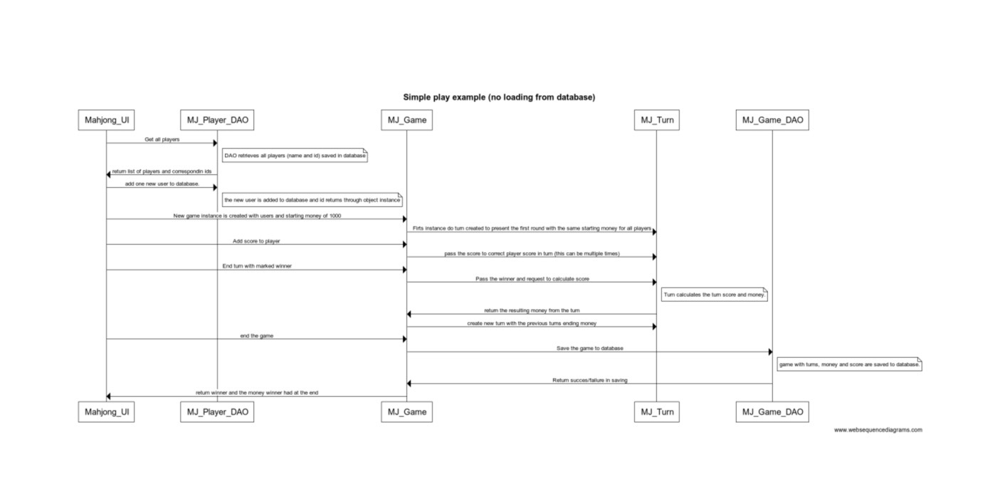

Mahjong manager contains 3 packages with following structure

The logic of the program is straight forward. However the components are based on somewhat poor design of classes and this makes the flow difficult to see in flowdiagram.
The sample says that there is no loading from database in that process and it means that game is started from scratch and not taken an old game from database. At the end the system automatically saves the game in to database. This is to prevent possibly already saved games from appearing in open games and for possible (dream on...) addition of reporting on which player has won or lost the most etc.

The database design was done in hurry and would also need some refactorign. The turn, turnScore and turnMoney should be merged into just one table.

