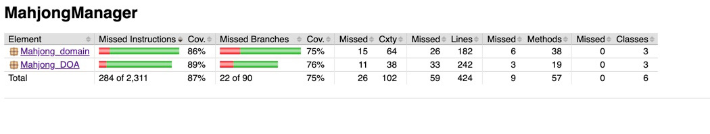

# Testing document
The program has been tested with automatic tests and manual testing of the gameplay

## Unit and Integration test

### Game logic testing
The package [MahJong_Domain](https://github.com/tuomoM/ot-harjoitustyo/tree/master/MahjongManager/src/main/java/Mahjong_domain) which contains the gamelogic is tested by test classes [MJTurnTest.java](https://github.com/tuomoM/ot-harjoitustyo/blob/master/MahjongManager/src/test/java/MJTurnTest.java) and [MJGameTest.java](https://github.com/tuomoM/ot-harjoitustyo/blob/master/MahjongManager/src/test/java/MJGameTest.java).
The actual integration testing is done with DOA tests.

### DOA testing
The package [Mahjong_DOA](https://github.com/tuomoM/ot-harjoitustyo/tree/master/MahjongManager/src/main/java/Mahjong_DOA) is tested for player creation and player load, aswell as game saving and loading.
In specific the tests in class [MjPlayerDoaTest.java](https://github.com/tuomoM/ot-harjoitustyo/blob/master/MahjongManager/src/test/java/MjPlayerDoaTest.java) provides with unit tests for player saving and loading.
The class [MjPlayerDoaTest.java](https://github.com/tuomoM/ot-harjoitustyo/blob/master/MahjongManager/src/test/java/MjPlayerDoaTest.java) containts tests to test the class [MJ_Game_DOA.java](https://github.com/tuomoM/ot-harjoitustyo/blob/master/MahjongManager/src/main/java/Mahjong_DOA/MJ_Game_DOA.java). These tests are also acting as integration tests, as they work through the game logic.
Test on database utilize a specific test database.

## Test coverage
Excluding the user interface the tests have row coverage of 87% and branch coverage of 75%

Test dont cover possible problems with disk access. Also due to unkown reason the tests could not cover case where loaded game turn score was changed and saved, this scenario howerver worked perfectly in manual testings.

## System testing
System has been tested manually for all cases desribed in [requirements](REQUIREMENTS.md) for all the cases according to how to use description found in [user manual](USERMANUAL.md).
## Issue not addressed
It is currently possible to set one player to play all player slots. This is not so much as an issue as one could potentially play the game alone. It is also possible to enter empty value to name of player, this also does not prevent the game from working and therefor can be considered to be a feature.