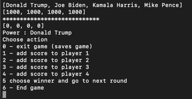

# How to use Mahjong manager

Download latest .jar file from [here](https://github.com/tuomoM/ot-harjoitustyo/releases/final).

Start the game with command >java -jar MahjongManager.jar

First time you run the game, database has no players and there are no saved games.

Choose 1 to start a new game.
System will ask for player names. Input player names one by one:

Once you have added all the players, the game can start

You can add scores to each player according to gameplay by entering number between 1 and 4. Note that player 1 in this case mr Trump is the power player.

add scores to all players. The player scores are visible in the screen:

Once all scores are calculated you can end the round by entering 5. Once you do so you are asked to input the winner of the round (1-4)

Now a new round has started. As you can see the power player has moved to next player, now mr Biden. the power will move at end of every round if the power player does not win the round. You can play as many rounds as you want.If you want to save the game and continue later you can press 0. This will save the game end exit the program.

To restart the game run again >java -jar MahjongManager.jar

Choose 2 to continue existing game

The games are listed based on id of the game and the time the game was saved. Choose the game you wish to continue by entering the correct id. in this case 1

You can continue to play as many rounds as you wish. To end the game choose 6

Once the players are created in the system you can use the previously saved players from database when starting the game.

You can still add new players by choosing 0 to enter a new player name.